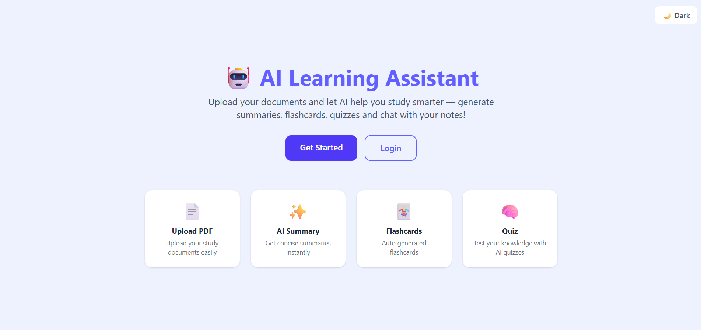
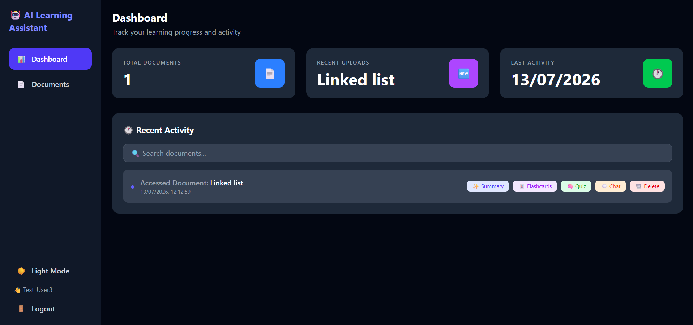
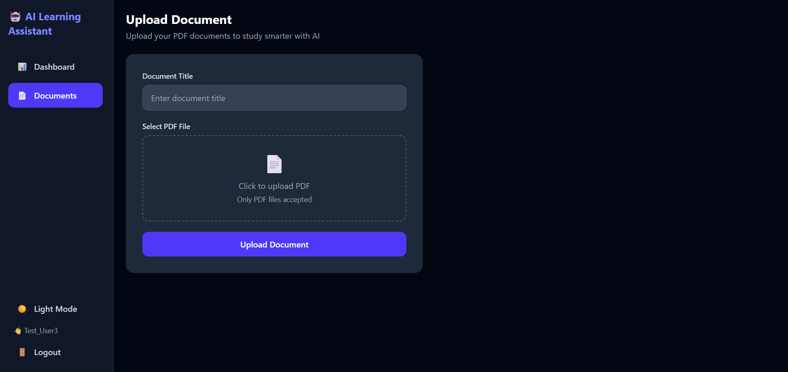
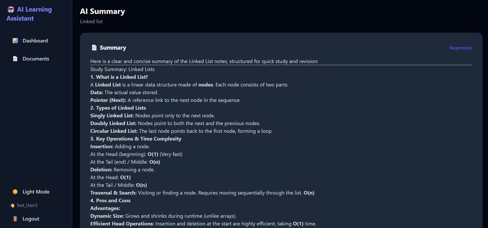
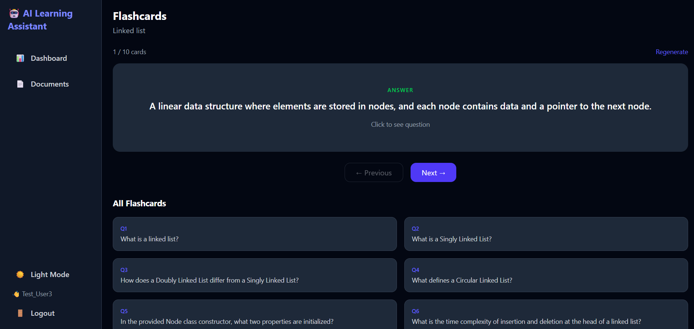
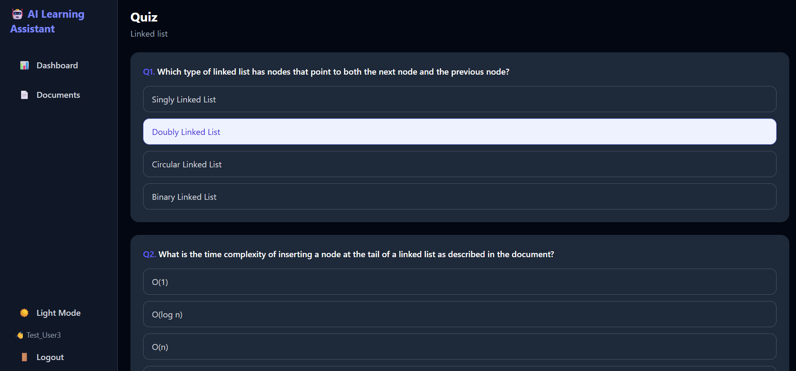
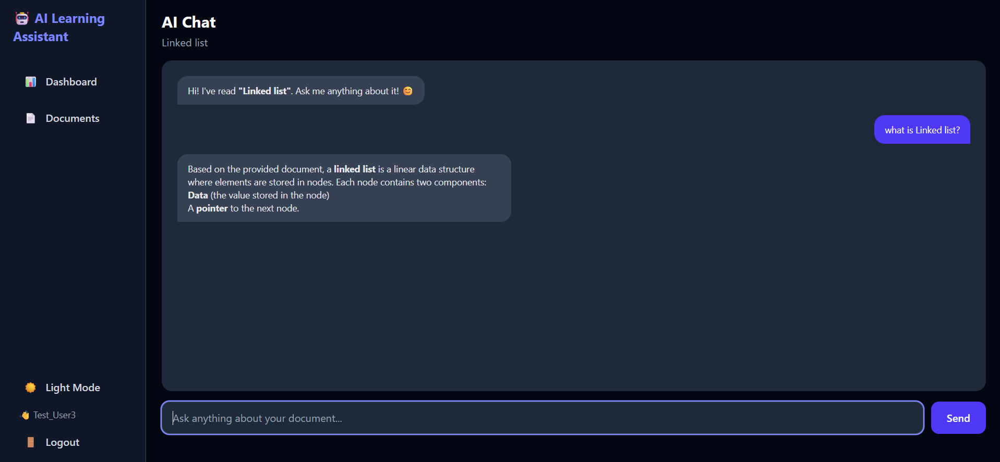

# 🤖 AI Learning Assistant — MERN + AI Study Platform

A full-stack AI powered study platform built with the MERN stack and Google Gemini AI. Upload your PDF documents and let AI help you study smarter with summaries, flashcards, quizzes and an interactive chat!

---

## 📋 Description

AI Learning Assistant allows students to upload their study documents and interact with them using Google Gemini AI. The platform automatically generates concise summaries, flashcards, multiple choice quizzes and answers document-based questions through an AI chat interface.

---

## 📸 Screenshots

### 🏠 Home Page


### 📊 Dashboard


### 📄 Upload Document


### ✨ AI Summary


### 🃏 Flashcards


### 🧠 Quiz


### 💬 AI Chat


---

## ✨ Features

### 👤 User
- Secure registration and login with JWT authentication
- Upload PDF study documents
- AI powered document summary generation
- Auto generated flashcards with flip animation
- Multiple choice quiz generation with scoring and explanations
- AI chat — ask questions about your documents
- Dark mode / Light mode toggle
- Dashboard with document management

### 🤖 AI Features (Google Gemini)
- **Summary** — Concise structured summary of entire document
- **Flashcards** — Auto generated Q&A flashcard sets
- **Quiz** — Custom MCQ quiz with configurable question count
- **Chat** — Context aware AI responses based on document content

---

## 🛠️ Tech Stack

| Layer | Technology |
|---|---|
| Frontend | React 19, Vite, Tailwind CSS |
| Backend | Node.js, Express.js |
| Database | MongoDB, Mongoose, MongoDB Atlas |
| AI | Google Gemini API (GenAI) |
| Auth | JWT, Bcryptjs |
| File Upload | Multer, pdf-parse |
| HTTP Client | Axios |
| State Management | Context API |

---

## 🔒 Security

- JWT based authentication for all protected routes
- Passwords hashed using bcryptjs
- Auth middleware protecting all user routes
- Token automatically attached to every request via Axios interceptors
- Environment variables for all sensitive data

---

## 📁 Folder Structure

```
AI-Learning-Assistant/
├── backend/
│   ├── config/             # MongoDB connection
│   ├── controllers/        # Business logic (auth, documents, AI)
│   ├── middleware/         # JWT auth middleware
│   ├── models/             # Mongoose schemas (User, Document)
│   ├── routes/             # Express route definitions
│   ├── uploads/            # Uploaded PDF files
│   └── server.js           # Entry point (port 5000)
│
├── frontend/
│   └── src/
│       ├── components/     # Sidebar
│       ├── context/        # AuthContext, ThemeContext
│       ├── pages/          # Dashboard, Upload, Summary, Flashcards, Quiz, Chat
│       ├── services/       # API service functions
│       ├── api/            # Axios instance
│       └── utils/          # API paths
│
└── screenshots/            # App screenshots
```

---

## ⚙️ Installation & Setup

### Prerequisites

- [Node.js](https://nodejs.org/) v18+
- [MongoDB Atlas](https://www.mongodb.com/atlas) account
- [Google AI Studio](https://aistudio.google.com) API Key
- [Git](https://git-scm.com/)

### 1. Clone the Repository

```bash
git clone https://github.com/teena227/ai-learning-assistant.git
cd ai-learning-assistant
```

### 2. Setup the Backend

```bash
cd backend
npm install
```

Create a `.env` file inside `backend/`:

```env
MONGO_URI=your_mongodb_connection_string
JWT_SECRET=your_jwt_secret_key
PORT=5000
GEMINI_API_KEY=your_gemini_api_key
```

```bash
npm run dev
```

> Backend runs on **http://localhost:5000**

### 3. Setup the Frontend

```bash
cd ../frontend
npm install
```

Create a `.env` file inside `frontend/`:

```env
VITE_API_URL=http://localhost:5000/api
```

```bash
npm run dev
```

> Frontend runs on **http://localhost:5173**

---

## 🌐 API Routes

### Auth
| Method | Endpoint | Access | Description |
|---|---|---|---|
| POST | /api/auth/signup | Public | Register a new user |
| POST | /api/auth/login | Public | Login and receive JWT token |

### Documents
| Method | Endpoint | Access | Description |
|---|---|---|---|
| POST | /api/documents/upload | User | Upload a PDF document |
| GET | /api/documents | User | Get all user documents |
| GET | /api/documents/:id | User | Get single document |
| DELETE | /api/documents/:id | User | Delete a document |

### AI
| Method | Endpoint | Access | Description |
|---|---|---|---|
| POST | /api/ai/summary | User | Generate AI summary |
| POST | /api/ai/flashcards | User | Generate flashcards |
| POST | /api/ai/quiz | User | Generate quiz |
| POST | /api/ai/chat | User | Chat with document |

---